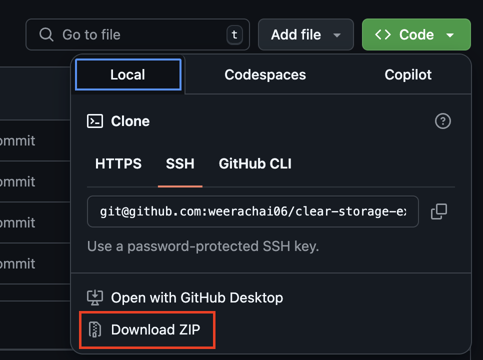
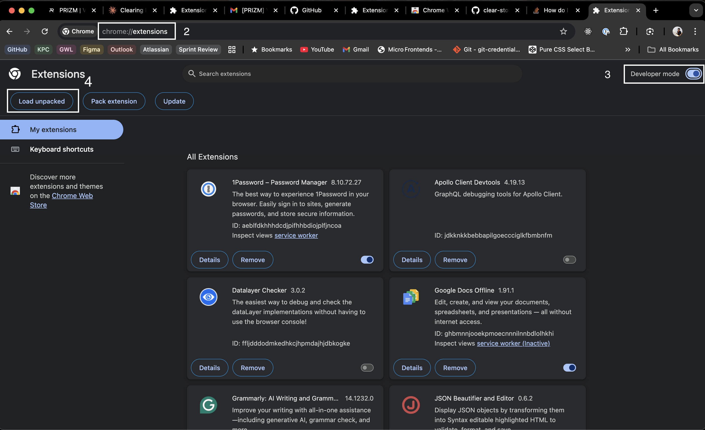
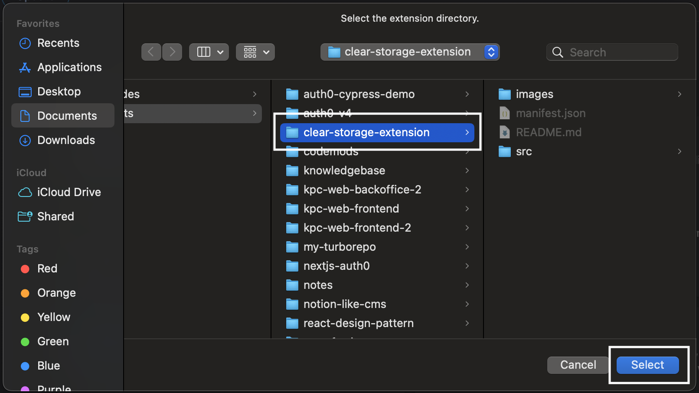
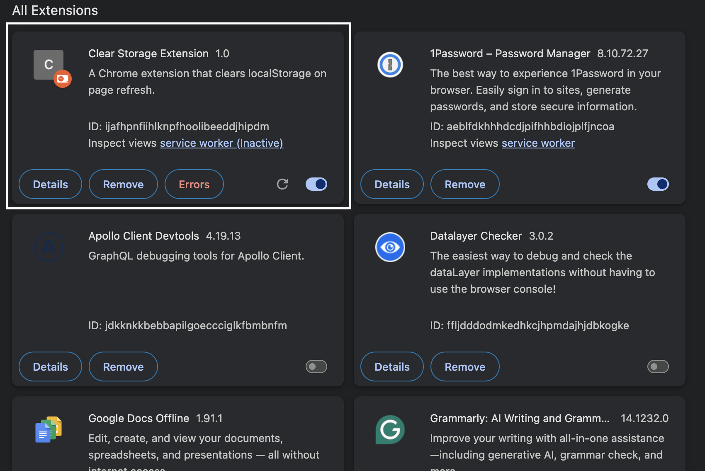

# Clear Storage Extension

This Chrome extension automatically clears the `localStorage` of the current webpage whenever the page is refreshed. This is especially useful for developers and testers who need to ensure they're working with a clean state each time they load a page.

## Features

- **Automatic Clearing**: Clears `localStorage` on page refresh
- **Lightweight**: Minimal impact on browser performance
- **Zero Configuration**: Works immediately after installation

## Special Note for PRIZM Website
For users of the [PRIZM](global.prizm.co.k) website who are voting: This extension will only solve the issue when you encounter the error `잠시 후 다시 시도해주세요` (Please try again later). It cannot resolve the `This email is not available` error.

## Installation

### From Source Code

1. Clone the repository or download the ZIP file.
   

2. Open the Chrome Extensions page
   - Navigate to `chrome://extensions/` in your Chrome browser
   - Enable "Developer mode" by toggling the switch in the top right corner
   - Click on "Load unpacked"
   
   

3. Select the `clear-storage-extension` directory
   

4. The extension should now be installed and active
   

## Usage

The extension works automatically with no additional configuration:

1. Install the extension
2. Browse websites as normal
3. When you refresh any page, the extension will automatically clear its localStorage

## Use Cases

- Testing web applications with clean storage state
- Debugging localStorage-related issues
- Privacy enhancement while browsing

## Notice

This project is provided as-is and may be removed in the future.

## License

This project is licensed under the MIT License. See the LICENSE file for more details.